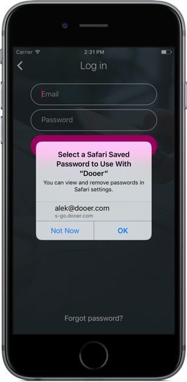

# SharedWebCredentials
[](http://cocoadocs.org/docsets/SharedWebCredentials)
[](http://cocoadocs.org/docsets/SharedWebCredentials)
[](http://cocoadocs.org/docsets/SharedWebCredentials)

The Shared Web Credentials API is used to store credentials
in the iCloud keychain to be shared among and between native iOS
apps and web apps on Safari for iOS and MacOS.

This is a Swift wrapper for that Core Foundation API.



## References
Apple Developer Documentation: [Shared Web Credentials](https://developer.apple.com/reference/security/1654440-shared_web_credentials)

WWDC Session 506: [Your App, Your Website, and Safari](https://developer.apple.com/videos/play/wwdc2014/506/)

## Example usage

```swift

// Fetch credentials
SharedWebCredentials.request(fqdn: "webapp.example.com") { credential, error in
    if let credential = credential {
        print("Account: \(credential.account), Password: \(credential.password)")
    }
}

// Save new credential
let credential = Credential(account: "test@example.com", password: "p4ssw0rd")
SharedWebCredentials.save(credential: credential, fqdn: "webapp.example.com") { error in
    print("Saved!")
}

// Delete credential after password reset
SharedWebCredentials.delete(account: "test@example.com", fqdn: "webapp.example.com") { error in
    print("Deleted!")
}

```

## Requirements & Swift versions

- Version 0.1.x is built for Swift 2.3
- Version 0.2.x and above is built for Swift 3.0

## Installation

### Cocoapods

To integrate SharedWebCredentials into your Xcode project using CocoaPods, specify it in your `Podfile`:

```ruby
source 'https://github.com/CocoaPods/Specs.git'
use_frameworks!
platform :ios, '8.0'

pod 'SharedWebCredentials', '~> 0.1'
```

Then, run the following command:

```bash
$ pod install
```

### Carthage

To integrate SharedWebCredentials into your Xcode project using Carthage, specify it in your `Cartfile`:

```ogdl
github "MrAlek/SharedWebCredentials" >= 0.1
```

## License

SharedWebCredentials is available under the MIT license. See the LICENSE file for more info.
